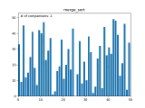

# Sorting-Algorithms-Visualisation
Sorting algorithm visualisation using matplotlib
# Sorts Included
- Bubble
- insertion
- merge
- selection
# Deminstration Gifs
## For larger or higher quality sorting videos look in the video folder for sorts up to 200 numbers
## Bubble
- 10

- 15

- 25

- 50

## Insertion

- 10

- 15

- 25

- 50

## Merge

- 10

- 15

- 25

- 50

## Selection

- 10

- 15

- 25

- 50

